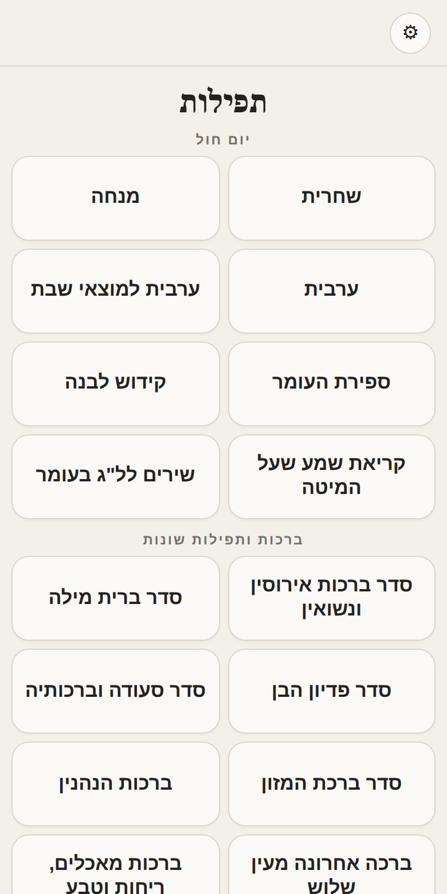
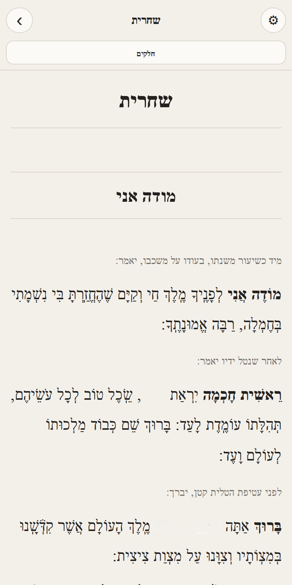
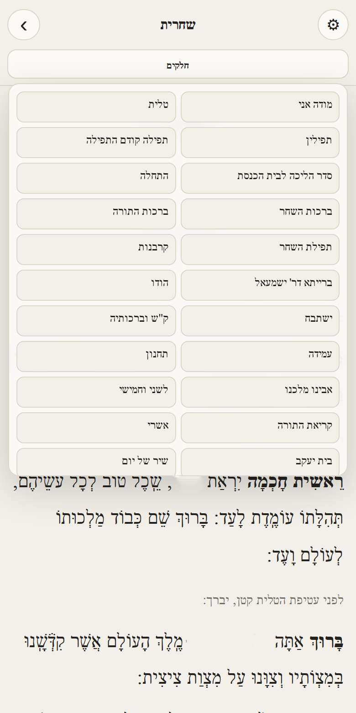
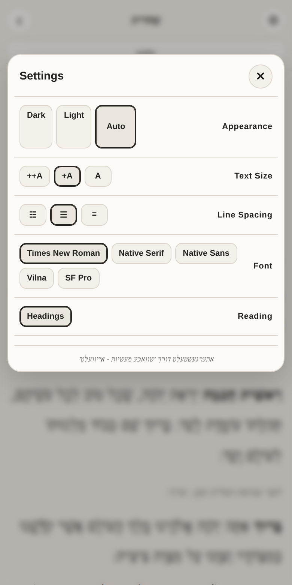

# Siddur for MindPhone (and Kosher Phones)

A proper siddur for the MindPhone (and many other kosher phones) has arrived!

## Table of Contents

- [Features](#features)
- [How to Use](#how-to-use)
- [Screenshots](#screenshots)
- [Credit](#credit)

## Features

- All the weekday prayers, tefillos, bakashos, Tehillim, and more.
- A nice range of fonts, including the well-known "Vilna" font used in many sifrei kodesh.
- A carefully thought-out, well-tested layout made for smaller screens.
- Settings options for black-on-white, white-on-black, or following your phone's own display setting.
- Relatively small — about 3.7MB.

## How to Use

1. Download the HTML file from this repo.
2. Upload it to your phone (via computer or card reader).
3. Open the file with any file app.

**Tip:** Star the file for quicker access.

You don't need to know what this is or how it works — just put it on your phone, tap the file, and it opens.

## Screenshots

| Home | Reading | Jump Menu | Settings |
|---|---|---|---|
|  |  |  |  |

## Credit

<a href="https://www.ivelt.com/forum/viewtopic.php?p=6886500#p6886500">@שוואכע מעשיות</a> — ivelt

